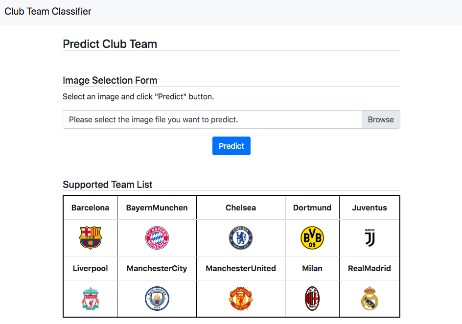

# Image_Classifier_Application

## Overview
Predict the club team from an football player image



## Usage

### Step0. Prepare a large number of images

### Step1. Create training and test data
```
python generate_train_and_test_data_224.py
```
- Save data(.npy file)

### Step2. Train using CNN(VGG16)
```
python cnn_vgg16_transfer.py
```
- Save model(.h5 file)

### Step3. Access the website
```
cd myApp
python manage.py runserver
```